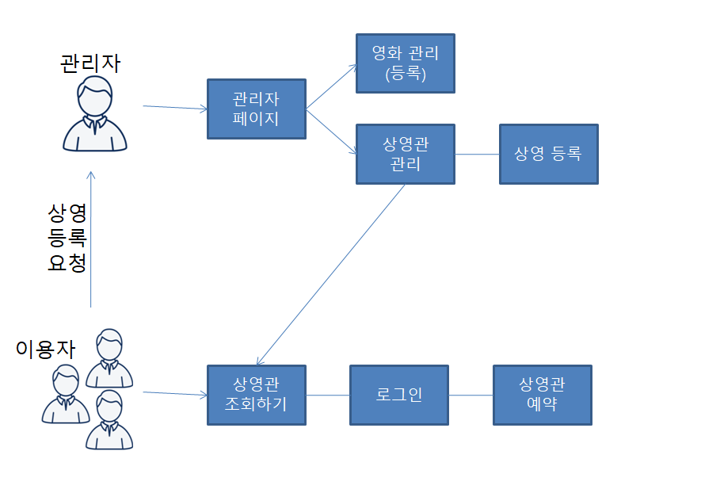
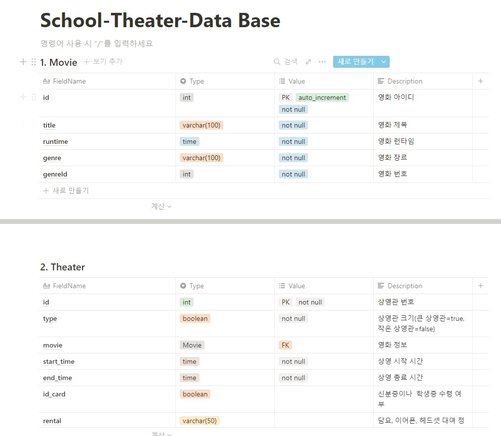
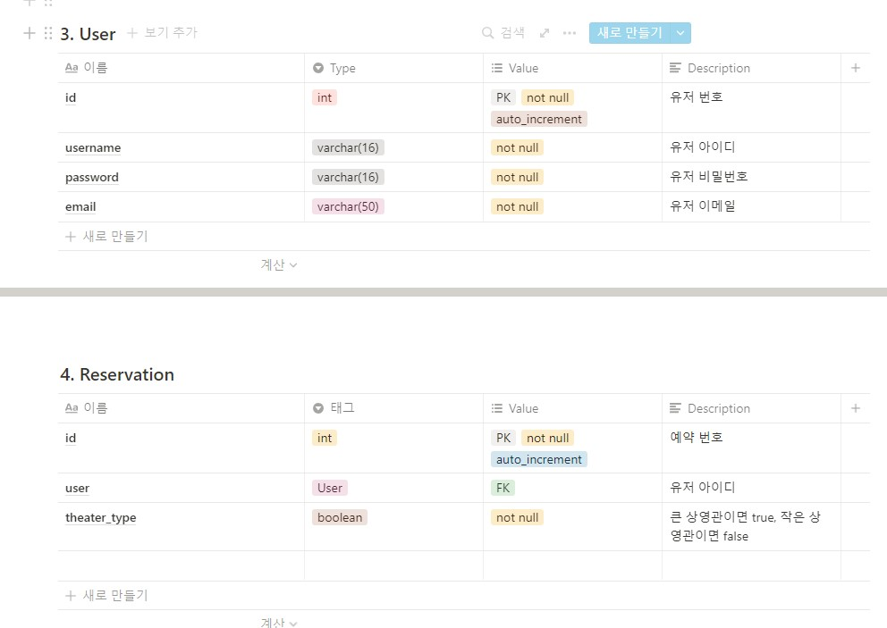

# School-Theater Web page

학교 영화관의 상영관 조회와 예약, 관리를 위한 서비스
<br/><br/>

## 프로젝트 개요

<hr/>

### 프로젝트 목적

- 학교 영화관을 온라인 서비스화하기
- 더 많은 학생이 학교 영화관을 사용할 수 있도록 홍보

<br/>

### 프로젝트 내용

- 관리자
  - 학교 영화관 영화 목록 관리
  - 상영관 관리

<br/>

- 서비스 이용자
  - 상영관 조회
  -

<br/>

### 프로젝트 개발환경

```
- IDE: vscode, STS4
- 언어: Java
- 프레임워크: Spring Boot
- 빌드도구: Maven
- 데이터베이스: MySQL
- 버전관리: Git
```

<br/><br/>

## Feature

<hr/>



<br/><br/>

## DB

<hr/>



